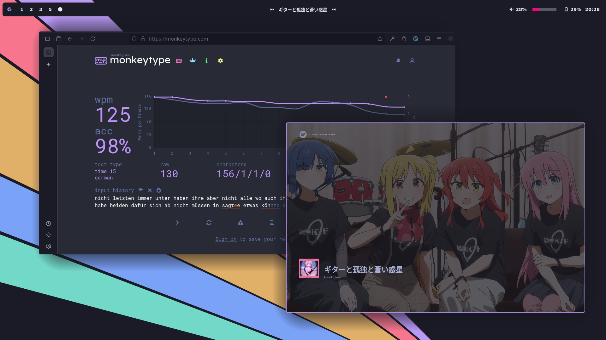
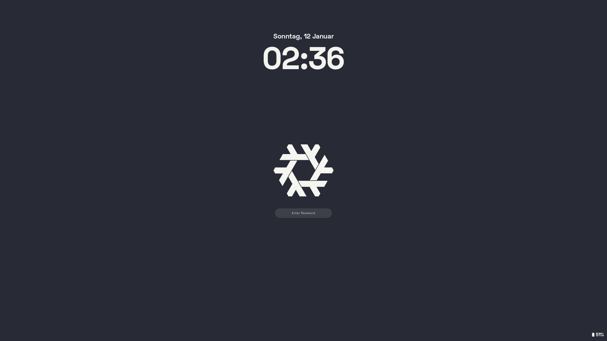
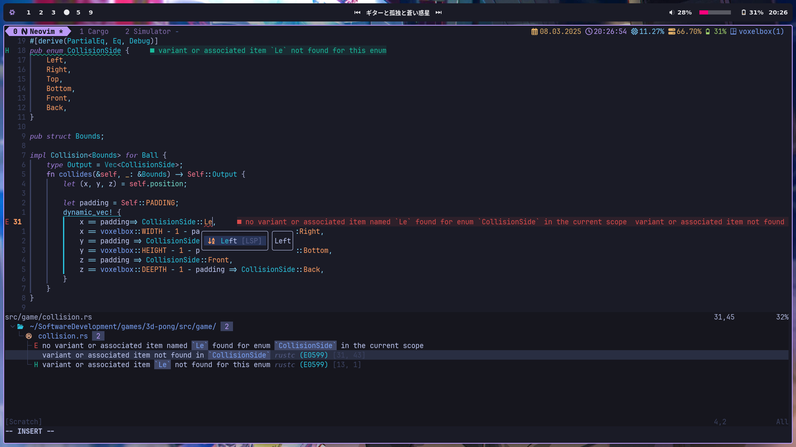
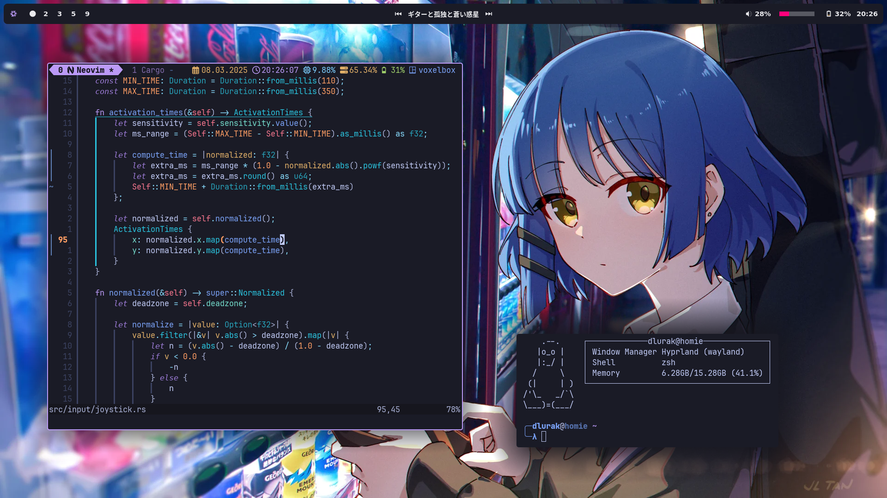

# Personal Nix Dotfiles

These are my personal Dotfiles which I use on NixOS.  
If you want to try it out on your NixOS machine remember to adjust the `flake/hosts/homie/hardware-configuration.nix`
The following programms are configured:

- NixOS
    - Flake
    - Home Manager
- Hyprland
- Hyprlock
- Hyprpaper
- Neovim (**Not** using nixvim or home-manager)
- Tmux
- Kitty
- Ghostty
- Ags (v1, **not** using home-manager)
- Moxide
- Zsh
- bat
- rofi-wayland

## Screenshots

## Touch Gestures

I run this configuration on a 2-1 Laptop so there are some touch gestures:

| Gesture                                  | Action                            |
| ---------------------------------------- | --------------------------------- |
| Swiping from the left/right edge inwards | Skip through workspaces           |
| Swiping from the bottom edge up          | Hide/Show onscreen keyboard       |
| Swiping up/down on the left edge         | Lower/Raise the volume            |
| Swiping up/down on the right edge        | Lower/Raise the screen brightness |
| Tap with 4 fingers                       | Show an app selector              |
| Swipe down with 4 fingers                | Kill the active programm          |
| Tap with 5 fingers                       | Toggle floating                   |
| Longpress with 2 fingers                 | Move window                       |
| Longpress with 3 fingers                 | Resize window                     |

## Keybindings

This aren't all but at least some keybindings:

### Hyprland

#### Programs

| Keybinding                   | Action          |
| ------------------           | --------------- |
| `Super` + `Return`           | Ghostty         |
| `Super` + `Shift` + `Return` | Ghostty         |
| `Super` + `w`                | Firefox         |
| `Super` + `Shift` + `w`      | Chromium        |
| `Super` + `n`                | Nautilus        |
| `Super` + `Shift` + `n`      | Thunar          |

#### Screenshots

Screenshots are copied to the clipboard and stored in `~/Pictures/screenshot.png`

| Keybinding              | Action                          |
| ----------------------- | ------------------------------- |
| `Super` + `Shift` + `s` | Screenshot of an area           |
| `Super` + `s`           | Screenshot of the entire screen |

#### Window Management

| Keybinding                      | Action                                   |
| ------------------------------- | ---------------------------------------- |
| `Super` + `Q`                   | Kill focused window                      |
| `Super` + `F`                   | Fullscreen window                        |
| `Super` `Shift` + `F`           | Fullscreen window (including bar)        |
| `Super` + vim motions           | Change focused window                    |
| `Super` + `Shift` + vim motions | Move window                              |
| `Super` + `Alt` + vim motions   | Resize window                            |
| `Super` + `Alt` + vim motions   | Change active window in a group          |
| `Super` + `Space`               | Center floating window                   |
| `Super` + `Shift` + `Space`     | Toggle floating window                   |
| `Super` + `Alt` + `Space`       | Pin floating window                      |
| `Super` + `T`                   | Toggle group (tabs)                      |
| `Super` + `Shift`+ `T`          | Lock group                               |
| `Super` + `E`                   | Toggle split (left/right <-> top/bottom) |
| `Super` + Number                | Switch to workspace                      |
| `Super` + `Shift` + Number      | Move window to workspace                 |
| `Super` + `Shift` + Number      | Move window to workspace                 |
| `Super` + `Tab`                 | Previous workspace (traverse history)    |
| `Super` + `F9`                  | Choose window                            |

#### Misc

| Keybinding                      | Action                          |
| ------------------------------- | ------------------------------- |
| `Super` + `U`                   | Lock screen (hyprlock)          |
| `Super` + `Shift` + `U`         | Power Menu                      |
| `Super` + `Shift` + `C`         | Colorpicker                     |
| `Super` + `Y`                   | Toggle controll center          |
| `Super` + `Shift` + `Y`         | Toggle bar                      |

### NeoVim

My NeoVim leader key is space, I then use another prefix for some kind of general topic per keybinding:
For example all things that are related to telescope use `<Space>p` followed by one more letter.

| Topic     | Namespace |
| --------- | --------- |
| Harpoon   | `h`       |
| NeoTest   | `t`       |
| Trouble   | `e`       |
| Telescope | `p`       |
| Spelling  | `l`       |
| Tabs      | `f`       |

Maybe I document more from my NeoVim setup when I find the motivation for it.

### tmux

I use `<C-f>` as the prefix

Maybe I document more from my tmux setup when I find the motivation for it.
