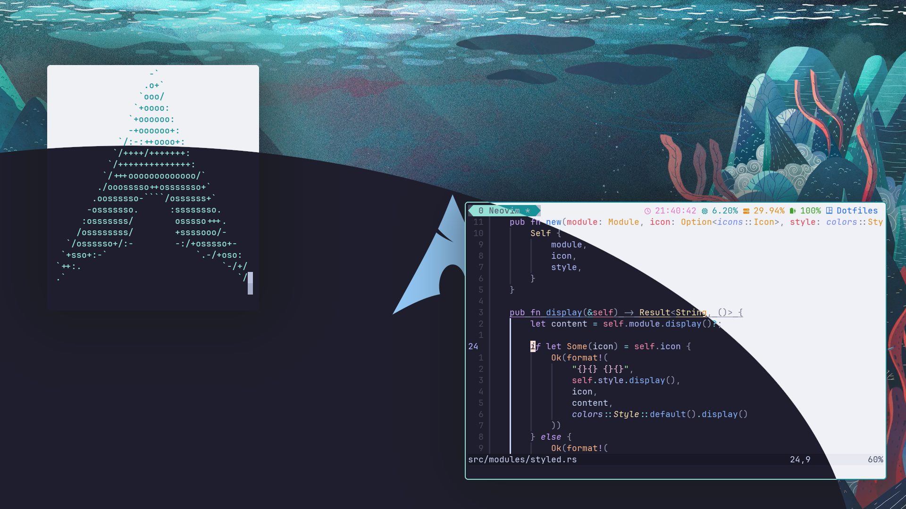
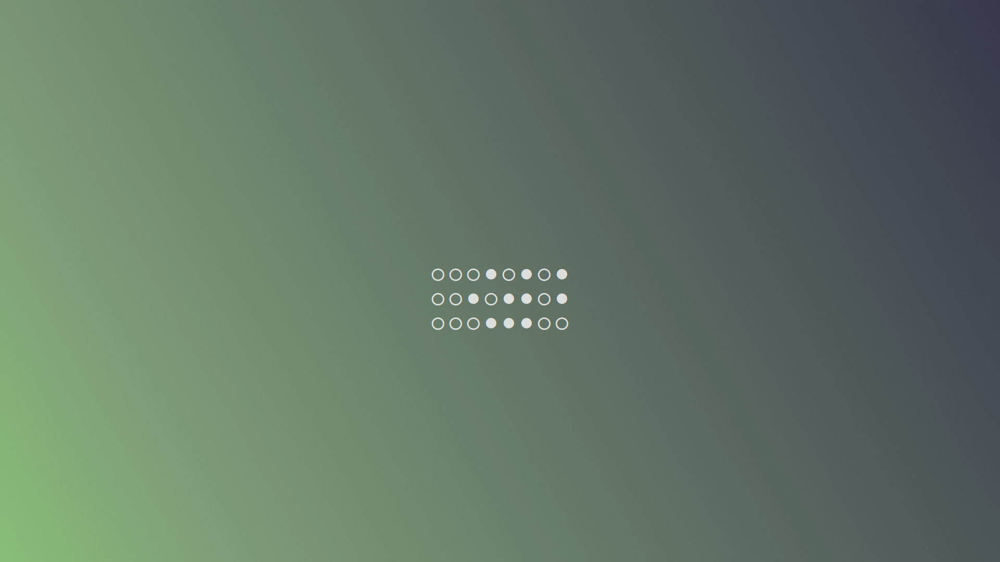
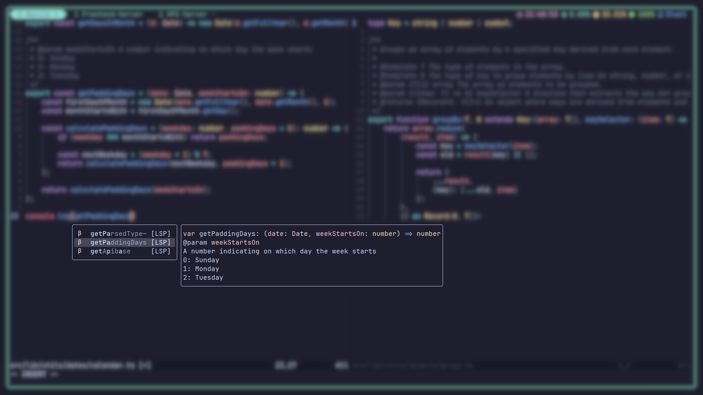
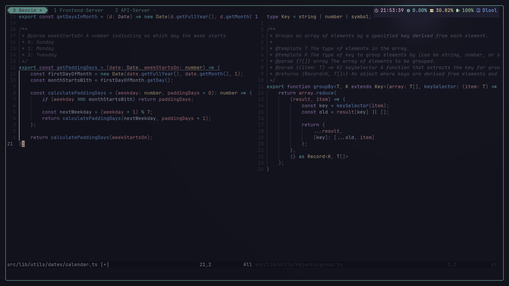

# Dotfiles

My dotfiles include configuration for these programs:

- hyprland
  - hyprlock
- nvim
- tmux
- wezterm
- waybar
- moxide
- zsh

## Abandoned configs

Configs for these programs are also included even though I don't use them (anymore):

- kitty
- bash

## Screenshots

It is possible to quickly switch between a dark mode (Catppuccin-Mocha) and a light mode (Catppuccin-Latte).

The lock screen has a minimal gradient and shows the time in binary.

NeoVim has an awesome LSP configuration. The completion menu is really pretty.

The tmux status bar uses muxbar. As a session manager moxide is used.

## Keybindings

This aren't all but at least some keybindings:

### Hyprland

#### Programs

| Keybinding         | Action          |
| ------------------ | --------------- |
| `Super` + `Return` | Wezterm         |
| `Super` + `w`      | Firefox         |
| `Super` + `n`      | Thunar          |
| `Super` + `d`      | wofi (launcher) |

#### Screenshots

| Keybinding              | Action                          |
| ----------------------- | ------------------------------- |
| `Super` + `Shift` + `s` | Screenshot of an area           |
| `Super` + `s`           | Screenshot of the entire screen |

#### Window Management

| Keybinding                      | Action            |
| ------------------------------- | ----------------- |
| `Super` + vim motions           | Move window focus |
| `Super` + `Shift` + vim motions | Move window       |

There are way more, maybe I will document more when I am motivated enough

## Included "Programs"

Under `./scripts/compiled/` you can find some very simple "programs":

| Program    | Language | Feature                                        |
| ---------- | -------- | ---------------------------------------------- |
| binarytime | Rust     | Convert numbers to their binary representation |
| colors     | C        | See some basic colors in the terminal          |
| timestamp  | Swift    | Get the current timestamp                      |

## Notes

I don't document which software in which version is needed. But the NeoVim needs to be at least 0.10
