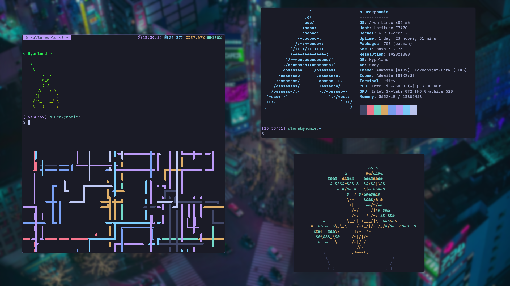
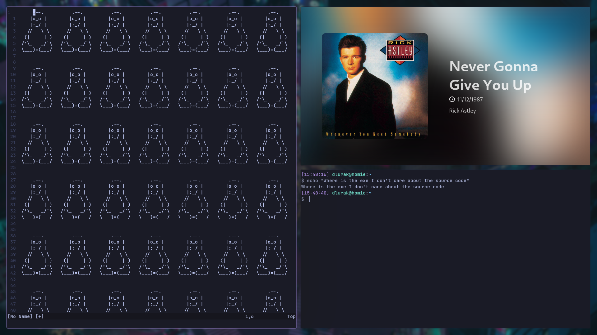
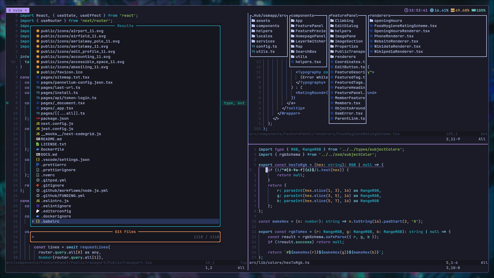

# Dotfiles

My dotfiles include configuration for these programs:

- hyprland
    - hyprlock
- nvim
- tmux
- kitty

## Status-bar

In theory waybar is also configured but I don't like my configuration and don't use a waybar.  
Instead I use [Muxbar](https://github.com/dlurak/muxbar) within tmux. As the muxbar config gets compiled into the binary it can be found in the source code as the default config.

## Screenshots

## Notes

I don't document which software in which version is needed. But the NeoVim needs to be at least 0.10
