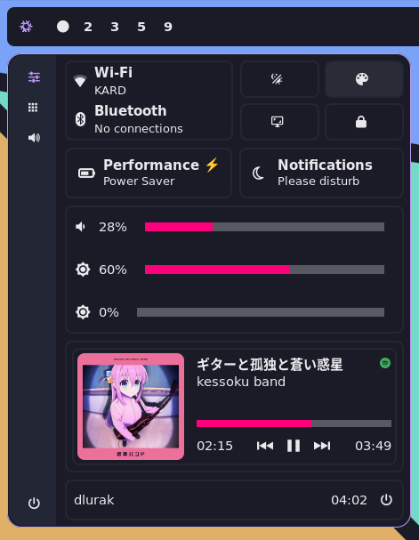

# Personal NixOS Dotfiles

These are my personal Dotfiles which I use on NixOS.  
If you want to try it out on your NixOS machine remember to adjust the `flake/hosts/homie/hardware-configuration.nix`
The following programms are configured:

- NixOS
    - Flake
    - Home Manager
- Hyprland
- Hyprlock
- Hyprpaper
- Neovim (**Not** using nixvim or home-manager)
- Tmux
- Ghostty
- Kitty
- Ags (v2, **not** using home-manager)
- Moxide
- Zsh
- bat
- rofi-wayland
- Zathura

## Screenshots

## Touch Gestures

I run this configuration on a 2-1 Laptop so there are some touch gestures:

| Gesture                                  | Action                            |
| ---------------------------------------- | --------------------------------- |
| Swiping from the left/right edge inwards | Skip through workspaces           |
| Swiping from the bottom edge up          | Hide/Show onscreen keyboard       |
| Swiping from the upper edge down         | Open an app launcher              |
| Swiping up/down on the left edge         | Lower/Raise the volume            |
| Swiping up/down on the right edge        | Lower/Raise the screen brightness |
| Longpress with 2 fingers                 | Move window                       |
| Longpress with 3 fingers                 | Resize window                     |
| Tap with 3 fingers                       | Take screenshot                   |
| Tap with 4 fingers                       | Toggle fullscreen                 |
| Tap with 5 fingers                       | Toggle floating                   |
| Swipe down with 4 fingers                | Kill the active programm          |
| Swipe up/down with 3 fingers             | Move to next/previous workspace   |

## Keybindings

This aren't all but at least some keybindings:

### Hyprland

#### Programs

| Keybinding                   | Action          |
| ------------------           | --------------- |
| `Super` + `Return`           | Ghostty         |
| `Super` + `Shift` + `Return` | Kitty           |
| `Super` + `w`                | Firefox         |
| `Super` + `Shift` + `w`      | Chromium        |
| `Super` + `n`                | Nautilus        |
| `Super` + `Shift` + `n`      | Thunar          |

#### Screenshots

Screenshots are copied to the clipboard and stored in `~/Pictures/screenshot.png`

| Keybinding              | Action                          |
| ----------------------- | ------------------------------- |
| `Super` + `Shift` + `s` | Screenshot of an area           |
| `Super` + `s`           | Screenshot of the entire screen |

#### Window Management

| Keybinding                      | Action                                   |
| ------------------------------- | ---------------------------------------- |
| `Super` + `Q`                   | Kill focused window                      |
| `Super` + `F`                   | Fullscreen window                        |
| `Super` `Shift` + `F`           | Fullscreen window (including bar)        |
| `Super` + vim motions           | Change focused window                    |
| `Super` + `Shift` + vim motions | Move window                              |
| `Super` + `Alt` + vim motions   | Resize window                            |
| `Super` + `Alt` + vim motions   | Change active window in a group          |
| `Super` + `Space`               | Center floating window                   |
| `Super` + `Shift` + `Space`     | Toggle floating window                   |
| `Super` + `Alt` + `Space`       | Pin floating window                      |
| `Super` + `T`                   | Toggle group (tabs)                      |
| `Super` + `Shift`+ `T`          | Lock group                               |
| `Super` + `E`                   | Toggle split (left/right <-> top/bottom) |
| `Super` + Number                | Switch to workspace                      |
| `Super` + `Shift` + Number      | Move window to workspace                 |
| `Super` + `Shift` + Number      | Move window to workspace                 |
| `Super` + `Tab`                 | Previous workspace (traverse history)    |

#### Misc

| Keybinding                      | Action                          |
| ------------------------------- | ------------------------------- |
| `Super` + `U`                   | Lock screen (hyprlock)          |
| `Super` + `Shift` + `U`         | Power Menu                      |
| `Super` + `Shift` + `C`         | Colorpicker                     |
| `Super` + `Y`                   | Toggle controll center          |
| `Super` + `Shift` + `Y`         | Toggle bar                      |
| `Super` + `F8`                  | Run command                     |
| `Super` + `F9`                  | Choose window                   |
| `Super` + `F10`                 | Random wallpaper                |

### NeoVim

My NeoVim leader key is space, I then use another prefix for some kind of general topic per keybinding:
For example all things that are related to telescope use `<Space>p` followed by one more letter.

| Topic     | Namespace |
| --------- | --------- |
| Harpoon   | `h`       |
| NeoTest   | `t`       |
| Trouble   | `e`       |
| Telescope | `p`       |
| Spelling  | `l`       |
| Tabs      | `f`       |

Maybe I document more from my NeoVim setup when I find the motivation for it.

### tmux

I use `<C-f>` as the prefix

Maybe I document more from my tmux setup when I find the motivation for it.

## Future Ideas

The dotfiles are never finished and I have some ideas for the future:

### Laptop

- Add a touch friendly app launcher using ags
- Add tabs into the controll center
    - Normal
    - Notifications
    - Audio
        - Mixer
        - Sink selection
    - Calculator
    - If the ICE Portal API is available create a new tab with train information
        - The german highspeed railway has an api on train about the train journey, it is soooooo cool!
- On Screenkeyboard using ags
- Brightness of external monitors
- Pause when the audio sink changes
- Add indcators using ags
    - screen brightness
    - volume
    - if possible keyboard backlight
- Add a screenshot menu
    - Area
    - One Screen
    - All screens
    - One window
    - Or recordings
- Customize discord
- Move to nixvim?
- [OpenDrop](image_url) for Airdrop
    - Really really really cool projct!

### Raspberry Pi

I also run this config on a Raspberry Pi 4, for this computer I have also some ideas:

- Host a bunch of services, no docker or something like that just systemd and nix.
- Host these:
    - [crosstab](https://github.com/dlurak/crosstab)
    - [gitea](https://github.com/go-gitea/gitea)
    - [LibreTranslate](https://libretranslate.com/)
    - [Librespeed](https://github.com/librespeed/speedtest-go)
    - [Homebox](https://hay-kot.github.io/homebox/)
    - [Immich](https://github.com/immich-app/immich)
    - [Monica](https://github.com/monicahq/monica)
    - [MediaTracker](https://github.com/bonukai/MediaTracker)
- Potentially also host these (I yet have to decide if I like and need them):
    - [Mealie](https://mealie.io/)
    - [Paperless](https://docs.paperless-ngx.com/)
    - [Wallabag](https://wallabag.org/)
    - [Hoarder](https://hoarder.app/)
    - [HabitTrove](https://github.com/dohsimpson/HabitTrove)
- Maybe install an airplay server to turn any monitor into an airplay monitor?
